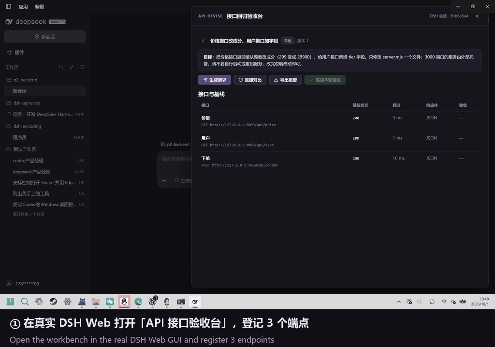

# DSH API Revise

**Snapshot your APIs. Rerun after the agent edits. Accept each difference — don't guess.**

**Pre-release v0.1.0.** Verified with **DSH Web 0.2.0-rc.2** on Windows, Node 24. UI and reports are **Chinese**. The real-model closed loop passed on 2026-10-01: baseline → real DeepSeek V4-Flash edited the backend → rerun → structured diffs → per-item acceptance → report. Model steps were never mocked; see [docs/real-model-validation.md](docs/real-model-validation.md).

[中文说明](README.zh-CN.md) · [Compatibility & limits](docs/compatibility.md)



This 64-second walkthrough uses stills from the actual run on 2026-10-01 (DSH Web 0.2.0-rc.2 + real DeepSeek V4-Flash). It is not a continuous recording. Details: [docs/real-model-validation.md](docs/real-model-validation.md).

> **Why:** your DSH agent changes backend code, and you no longer know whether endpoint behavior changed. DSH API Revise records response baselines before the edit and shows structured, field-level differences after it — status codes, fields, and numeric values with old → new values — side by side with a source-code diff. You accept every difference item by item, and export a report.

## What you get

- **Register endpoints:** method + URL + optional headers/body, all typed by hand in the DSH Web panel (no traffic capture — that is v2).
- **Baseline snapshot:** each endpoint is requested once and its response (status / headers / JSON or text body) is stored in the project's `.dsh-apirevise/` directory, together with a bounded snapshot of backend source files.
- **Current-session handoff:** the change goal plus the monitored endpoint list is sent to the current DSH session through DSH's normal prompt queue.
- **Rerun & compare:** after the model edits, one click re-requests every endpoint and produces a structured diff — JSON field-level differences (added / removed / type / value, numeric delta), status-code changes highlighted, text patch for plain-text bodies.
- **Per-item acceptance:** accept each endpoint, or mark it “needs work” with feedback that travels back into the next request. Comparisons go stale when the source changed after the rerun: you must rerun before accepting. Only when every endpoint is accepted against the current rerun can the round be completed.
- **Portable reports:** Markdown plus a single-file HTML report with embedded diffs, XSS-escaped and served with a strict CSP. Facts only — diffs never claim “the API is fine”; acceptance is the human's decision.

## Install

Use Node 22.19+ (22.x) or Node 24. Install and configure DSH according to its [official documentation](https://github.com/deepseek-ai/deepseek-harness). DSH handles your model credentials; API Revise has no separate API key.

### From npm (after publish)

```sh
dsh plugin --profile web add dsh-apirevise
```

### Source checkout

```sh
git clone https://github.com/Lostforest7/dsh-apirevise.git
cd dsh-apirevise
npm ci
npm run build
```

Stop DSH, then register the checkout in its Web profile and restart:

```sh
dsh plugin --profile web add /absolute/path/to/dsh-apirevise
dsh web
```

The repository includes built `lib/` files so DSH can load the plugin without running a package build script.

## Use it

1. Start your backend locally (e.g. `node server.mjs` from [examples/api-server](examples/api-server), port 3000).
2. Open a DSH project session whose directory is the backend project. Click **API 接口验收台** at the bottom right.
3. Create a round: title (what to change), goal (sent to the session), and the endpoints to monitor. Creating the round snapshots the baseline immediately.
4. Click **生成请求**, review it, and **发送到当前会话**. The model edits the backend code.
5. After the model finishes, click **重跑对比**. Review the structured diffs and the source-code diff; accept each endpoint or attach feedback and send the session back to work.
6. When every endpoint is accepted, click **完成本轮验收**, then **导出报告**.

Add `.dsh-apirevise/` to your project's `.gitignore`.

## What it is not

- Not a traffic-capture proxy (v2 direction); not a frontend tool (that is [dsh-revise](https://github.com/Lostforest7/dsh-revise)); not a test-framework runner (that is dsh-test-workbench territory).
- It never claims “the API is definitely fine.” Diffs present facts — status / fields / numeric old-and-new values — and acceptance remains a human decision.
- The model step is never mocked in validation; see [docs/real-model-validation.md](docs/real-model-validation.md).

## Development

```sh
npm ci
npm run check        # typecheck + unit tests + build
npm run dev          # standalone workbench preview (examples/api-server) on http://127.0.0.1:4320
```

Unit tests are fixture-based and run offline (loopback HTTP only), no DSH and no network required: [tests/unit](tests/unit).

## License

MIT
