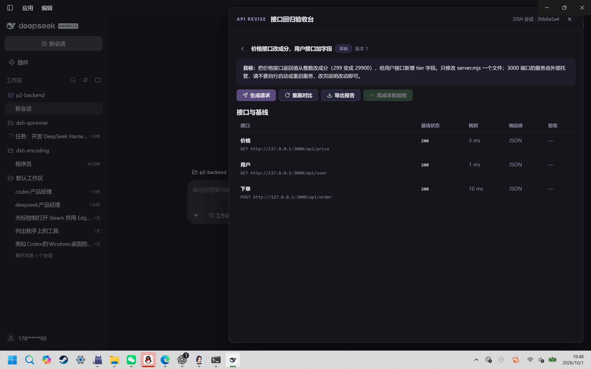
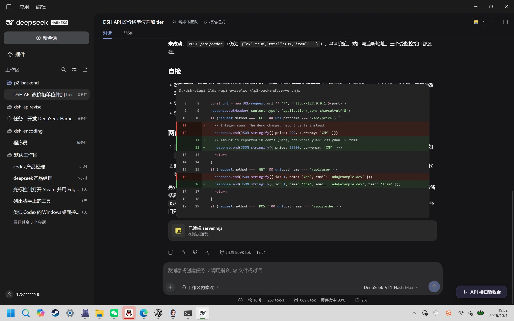
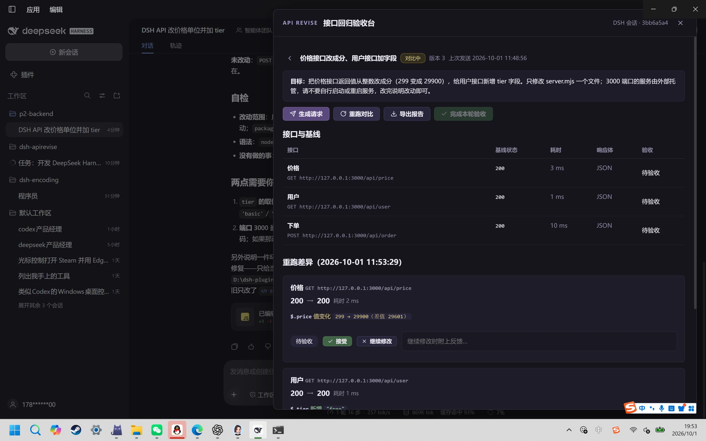
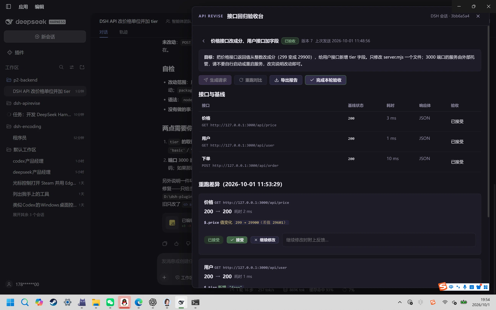

# 真实模型闭环验证（Phase 2 硬门槛）

日期：**2026-10-01**（本地 19:47–19:55）。插件：**dsh-apirevise 0.1.0**（Phase 1 构建）。运行环境：**DSH Web 0.2.0-rc.2 桌面宿主**（live `desktop` profile）、Node 24.21.0、Windows 11。

本次是**真实链路**验证：真实宿主安装、真实 GUI 操作、真实 DeepSeek 模型改后端代码。**模型环节未 mock**；后端请求由插件真实发出，响应由真实服务返回。

## 验证方式

- 插件经 DSH 插件管理器以 `link:D:/dsh-plugin2/dsh-apirevise` 装入 **live profile**（`dsh.profile.bundles` 追加 `dsh-apirevise`），宿主热应用：`include:dsh-apirevise … fiberPhase: active`；`POST /api/dsh-apirevise` 未认证探活返回 **401**（区别于 404，证明宿主半体已挂载）。
- **真实 GUI 操作**：在 127.0.0.1:19387 的 DSH Web 界面上，由 agent 用鼠标/键盘完成（用户明确授权"你也可以前端鼠标操控"；用户本人未自行操作）。界面右下角出现入口按钮「API 接口验收台」，面板内完成登记/快照/发送/重跑/验收/导出全流程。
- 后端示例项目：`work/p2-backend`（零依赖 `node:http`，监听 127.0.0.1:3000）。
- 模型：**真实 DeepSeek V4-Flash（推理等级 Max）**，请求经 DSH 正常消息队列发送到该项目的会话。

## 时间线（实测）

| 阶段 | 时刻（UTC / 本地） | 结果 |
|---|---|---|
| 插件装入 live profile + 探活 | 19:44–19:46 | 宿主 active；路由 401 |
| 建工作区与会话 | 19:47 | 经原生目录选择器创建 `p2-backend` 工作区，自动进入新会话 |
| 登记 3 端点 + 基线快照 | 11:48:41Z / 19:48:41 | **3/3 HTTP 200**（价格 3 ms、用户 1 ms、下单 10 ms），JSON 响应；源码快照含改动前 `server.mjs` |
| 生成请求 + 发送到会话 | 11:48:56Z / 19:48:56 | 请求文本含目标、端点清单、纪律说明；`markSent` → 版本 2 |
| **真实模型改后端** | 19:49–19:52（约 2 分 45 秒，16 步） | 编辑 `server.mjs` 两处；`node --check` 通过（exit 0）；自述 `/api/order` 未改动 |
| 重启服务使新代码生效 | 19:52 | 独立探测：`price:29900`、`tier:"free"`、`order` 不变 |
| **重跑对比** | 11:53:29Z / 19:53:29 | 3/3 端点重请求；结构化差异出现（状态码列 + 字段级 diff） |
| 逐项验收 | 19:53–19:54 | 3/3 接受（价格 / 用户 / 下单），版本 3→6 |
| 完成本轮验收 + 导出报告 | 11:54:15Z / 19:54 | 轮次 `accepted`（版本 7）；`report.md` / `report.html` 落盘 |

## 模型实际改动 × 插件 diff 对照

| 接口 | 模型改动（磁盘复核） | 插件结构化 diff | 一致 |
|---|---|---|---|
| `GET /api/price` | `299` → `29900`（注释改为分单位） | `$.price 值变化 299 → 29900（差值 29601）` | ✅ |
| `GET /api/user` | 新增 `tier: 'free'` | `$.tier 新增 "free"` | ✅ |
| `POST /api/order` | 未改动（模型自述亦为"未改动"） | `无差异` | ✅ |

状态码三项均为 `200 → 200`（无变化，正确未高亮）。代码 diff 与响应 diff 并排呈现在面板与报告中；报告 HTML 内嵌 diff 且无脚本注入（CSP/XSS 转义按设计生效）。

## 证据截图（本次真实运行）









## 原始证据

```text
work/p2-backend/.dsh-apirevise/f4249020-a6db-4582-833b-bbb25cd7c6a3/
  round.json    7,908 B  版本 7 / status=accepted / 基线含改动前源码快照 / 3 条验收决定
  request.md      940 B  发送给会话的原始请求
  report.md     2,026 B  Markdown 报告（含旧值→新值与代码 diff）
  report.html   5,420 B  单文件 HTML 报告（内嵌 diff，CSP default-src 'none'）
```

## 验收操作者说明（诚实记录）

- 本轮所有 GUI 点击（含"接受""完成本轮验收"）由 **agent** 完成，不代表人类用户逐条手工确认；产品语义仍是"人类逐项验收"，本记录只声称流程与差异事实，不声称人工批准。
- 浏览器端"导出报告"的下载未在系统默认下载目录落盘（桌面宿主 WebView 未写 `Downloads`）；报告由 `finish`/`report` 写入项目目录，内容已核验。此为待改进项（面板增加"复制报告 HTML/路径"回退）。

## 发现的问题（如实记录）

1. **DSH 沙箱在本工作区无法配置写权限**：模型执行 shell 时报 sandbox ACL provisioning error（与 agent 侧 `pwsh` 工具 `SetNamedSecurityInfoW failed (Win32 5)` 同源，Phase 0/1 已遇到）。模型申请一次 `danger-full-access` 批准执行 `diagnose-windows-sandbox-acl.ps1`，为目录补当前用户完全控制（脚本提供回滚命令），随后 `node --check` 通过。
   - 该批准提示由 agent 点击；**原意是"拒绝"，因坐标偏差点成了"允许一次"**——如实记录此操作失误。改动限于 `work/p2-backend` 目录权限，可回滚，未涉及文件内容与所有者。
2. 插件本身无功能性缺陷被观察到：状态码/字段/数值 diff、陈旧守卫、逐项验收门、跨会话隔离、报告转义均按设计工作。

## 结论与限制

✅ **Phase 2 硬门槛通过**：真实 DSH Web 0.2.0-rc.2 安装 + 真实 DeepSeek 模型改后端 + 登记→基线→发送→重跑→结构化 diff→逐项验收→报告导出，完整闭环跑通；diff 与磁盘/HTTP 独立复核一致。

限制：单项目、3 端点、单轮、一台 Windows 机器、一个模型（V4-Flash）；不构成对其他模型、复杂项目、并发编辑场景的质量结论。`/api/order` 的"无差异"仅代表**本轮未变化**，不代表该接口永远正确——diff 只呈现事实。
